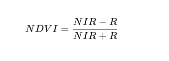

# Kleur detecteren

Dit is nodig om te bepalen welke bomen gezond zijn en welke niet. We berekenen de gemiddelde pixelwaarde per gedetecteerde boom en gebruiken deze informatie om te beoordelen of de boom gezond is.

## NDVI (Normalized Difference Vegetation Index)

De **Normalized Difference Vegetation Index (NDVI)** is een maatstaf die wordt gebruikt om de gezondheid van vegetatie te evalueren op basis van satelliet- of luchtfoto's. NDVI maakt gebruik van de reflectie in twee belangrijke spectrale banden: het rode licht (R) en het nabij-infrarode licht (NIR). De formule voor NDVI is:

Waarbij:
- **NIR** de reflectie in het nabij-infrarode spectrum is (meestal band 3),
- **R** de reflectie in het rode spectrum is (meestal band 1).

### Interpretatie van NDVI-waarden:
- **Gezonde vegetatie**: NDVI-waarden tussen **0.2** en **0.9** duiden op aanwezigheid van gezonde vegetatie. Hoe dichter bij **1**, hoe gezonder de vegetatie.
- **Kale grond of geen vegetatie**: NDVI-waarden tussen **0.0** en **0.2** wijzen vaak op kale grond of gebieden zonder vegetatie.
- **Water**: NDVI-waarden tussen **-0.3** en **0.1** worden vaak geassocieerd met waterlichamen.
- **Zieke of dode vegetatie**: NDVI-waarden onder **0.2** kunnen wijzen op ongezonde of dode vegetatie.

Meer info kun je hier vinden: [cropin.com](https://www.cropin.com/blogs/ndvi-normalized-difference-vegetation-index)
 