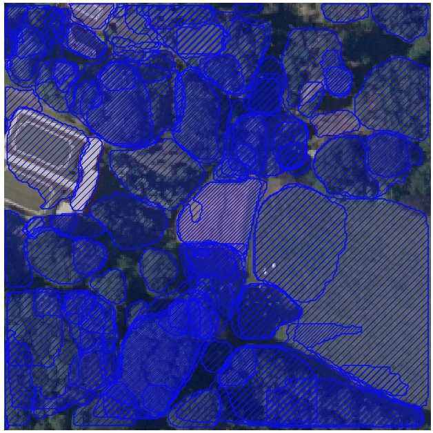
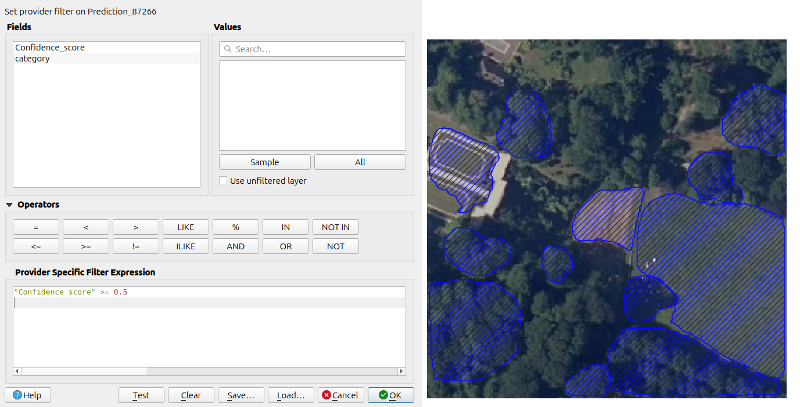
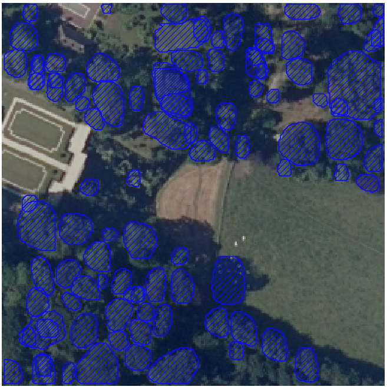

# Detectree2Lib
Hoe kun je deze map zelf gebruiken klik [Hier](docs/README.md) voor meer info.

## 230103_randresize_full.pth

    
    

### Confidence_score

## urban_trees_Cambridge_20230630.pth

    
    

### Link to github: 
https://github.com/PatBall1/detectree2 

### Models:
https://zenodo.org/records/12773341
