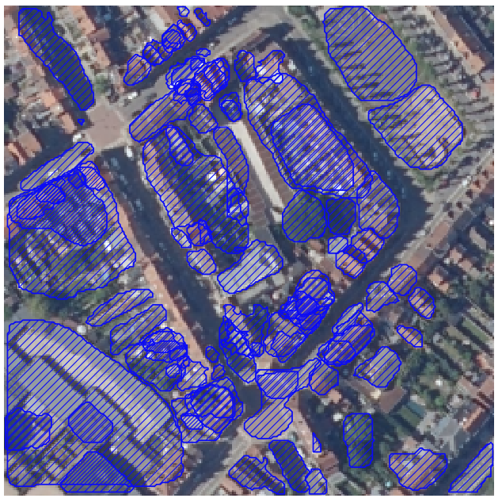
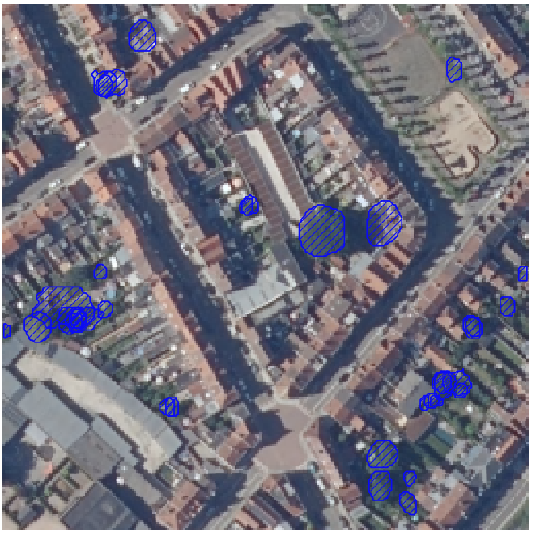
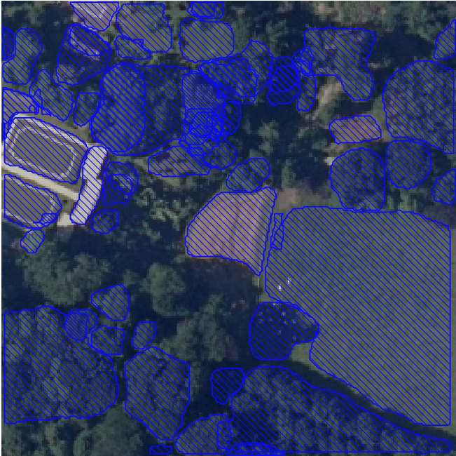
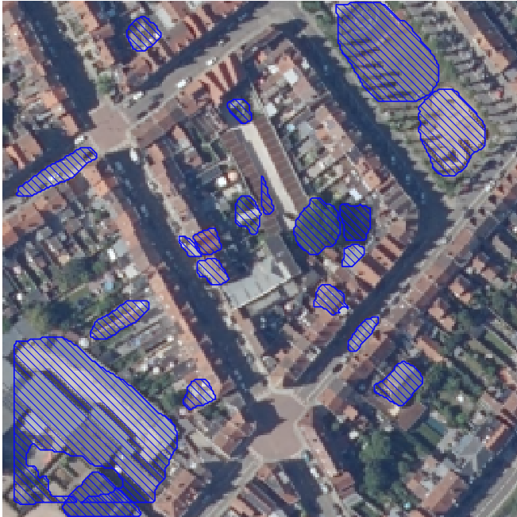
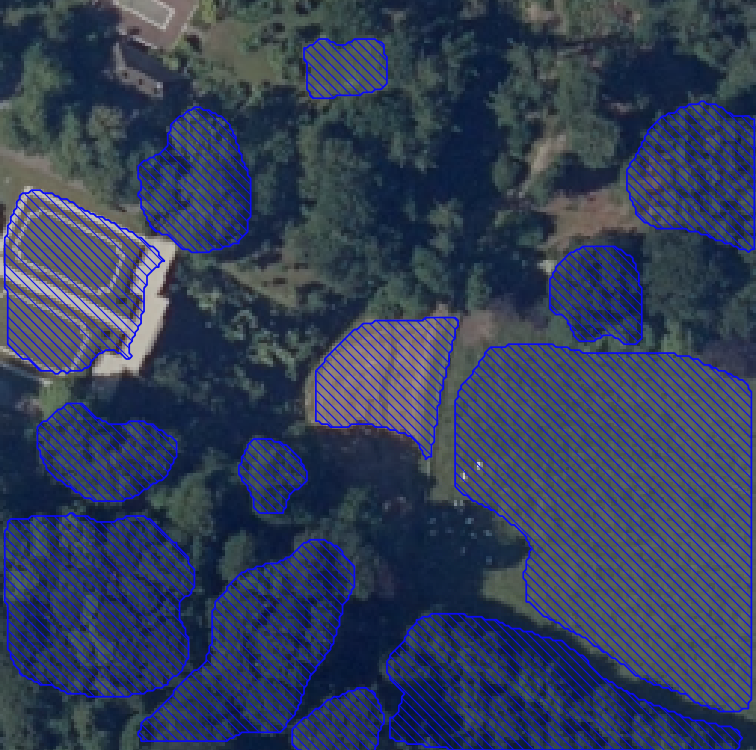
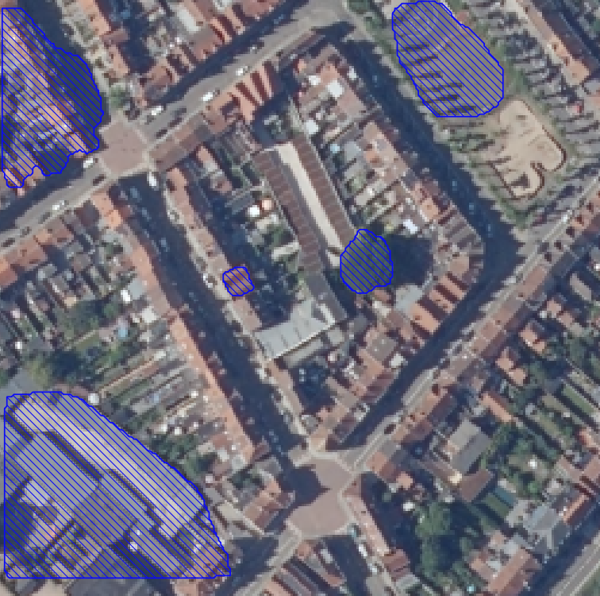
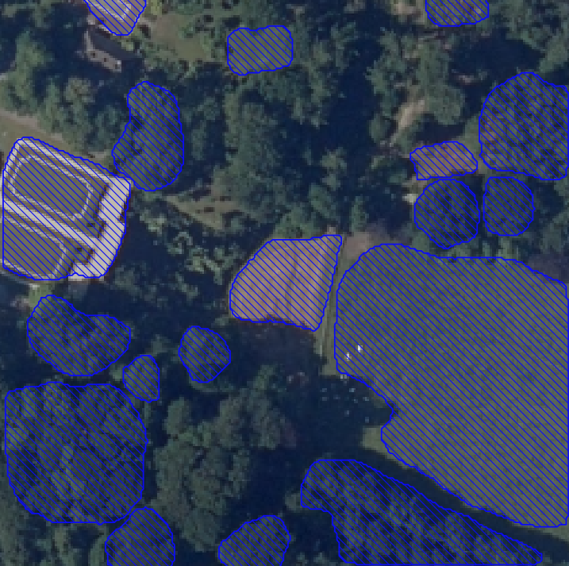
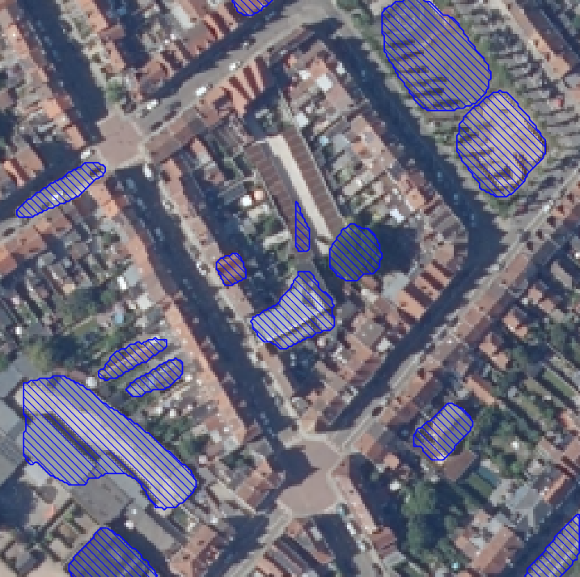

# Model onderzoek
We besluiten dat de [urban_trees_Cambridge_20230630.pth](#urban_trees_cambridge_20230630pth) de beste keuze is. Bij elk voorbeeld wordt de confidence score beoordeeld om te bepalen welke de hoogste nauwkeurigheid biedt. Dit is duidelijk te zien in het eerste voorbeeld.

## 230103_randresize_full.pth

    
    

### Confidence_score
[Confidence_score](./img/ConfScore.png)

## urban_trees_Cambridge_20230630.pth

    
    

## 230729_05dates.pth

    
    

## 230717_base.pth

    
    

## 220723_withParacouUAV.pth

    
    

