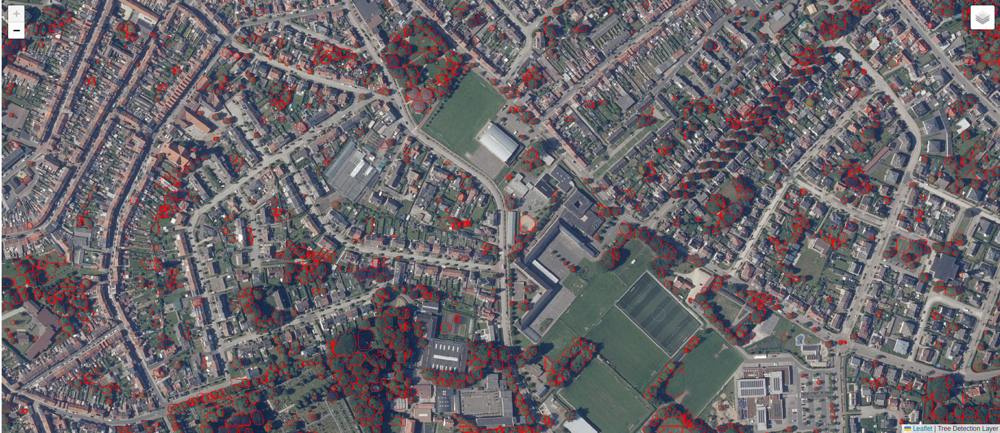

# TreeHealthDetectionAI

## Het team

[ Robbe De Wispelaere](https://github.com/RobbeDeW)

[ Colin Bossuyt](https://github.com/BossuytC)

[ Niels Denoo](https://github.com/NielsDenoo)

## Beschrijving van project

### Dit is hoe wij het project zien en welke stappen hiervoor nodig zijn:

- **Dataverzameling**: Zoek de nodige luchtfoto's en infraroodkaarten van Vlaanderen. Deze zijn beschikbaar via online bronnen, maar ook bij VIVES-collega's in Roeselare.
- **Dataset toepassen**: Onderzoek hoe we de online beschikbare dataset kunnen gebruiken in ons project. Kunnen we de bomen in de dataset detecteren en analyseren?
- **Model toepassen**: Pas een voorgetraind model toe dat bomen herkent. Dit model wordt gebruikt om luchtfoto’s te analyseren en te bepalen of een boom gezond is of tekenen van afsterven vertoont.
- **Dashboard**: Ontwikkel een uitgebreid dashboard met Plotly Dash, waarin gebruikers de resultaten kunnen bekijken en navigeren. Zorg voor een interactieve en gebruiksvriendelijke interface.
- **Deployment op mini-PC**: Zorg dat het volledige systeem offline werkt en stand-alone kan draaien op een mini-PC met een Linux-besturingssysteem, geschikt voor gebruik tijdens open dagen en evenementen

### Concept

We passen een bestaand model toe dat, op basis van RGB luchtfoto’s en een infraroodlaag, bomen kan detecteren en hun gezondheid kan beoordelen. De dataset die we hiervoor gebruiken, bestaat uit grote JP2-bestanden die niet direct bruikbaar zijn. Daarom converteren we deze bestanden naar kleinere PNG-tiles met behulp van de gdal2tiles-bibliotheek. Dit proces verdeelt de grote afbeeldingen in meerdere kleine tiles die het model kan gebruiken om bomen te detecteren.

Na de detectie van de bomen controleren we de infraroodkleur op de locaties waar bomen zijn gedetecteerd. Hiermee kunnen we beoordelen of een boom gezond is of tekenen van aftakeling vertoont. Op basis van deze gegevens kunnen we bijvoorbeeld statistieken genereren over het aantal gezonde bomen in een bepaalde regio, zoals Brugge.

Voor de visualisatie ontwikkelen we een interactief dashboard in Python met de Dash- en Dash-Leaflet-bibliotheken. Dit dashboard zal verschillende kaartlagen bevatten, waaronder RGB-foto’s, CIR (Color Infrared) beelden, en een kaart die de resultaten van het model toont. Daarnaast biedt het dashboard statistieken over de gezondheid van de bomen. Het doel is een gebruiksvriendelijke en interactieve interface te creëren waarmee iedereen eenvoudig kan werken.

## Mappenstructuur
- [Dashboard](Dashboard/): Alle informatie over hoe ons dashboard werkt. 
- [DetectCollor](DetectCollor/): Alle info over hoe we ongezond bomen detecteren.
- [Detectree2Lib](Detectree2Lib/): Alle informatie over hoe we de library toepassen op ons project. 
- [docs](docs/): Alle informatie over het proces en de documentatie

## Dataset

Link naar de dataset die we gaan gebruiken voor de AI te trainen en voor het dashboard.
[Vlaanderen.be](https://download.vlaanderen.be/product/9531)
