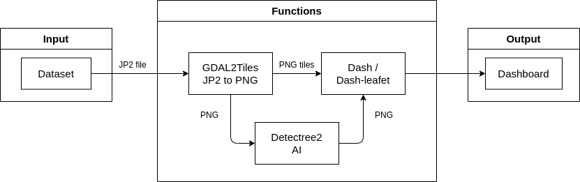

# Documentatie

Op deze pagina vindt je de documentatie van dit project

## Architectuur documentatie

## Proces

### Week 1

In de eerste week hebben we vooral het concept uitgewerkt en zitten brainstormen over hoe we het gingen aanpakken. We waren ook al begonnen met het zoeken naar een goede dataset. Verder hebben we het [projectcanvas](./docs/project-canvas.pdf) ingevuld en begonnen aan de README.

### Week 2

In de tweede week hebben we gezocht naar een goede library voor een AI algoritme, deze is [detectree2Lib](https://github.com/PatBall1/detectree2). We hebben ook gezocht naar een manier om de JP2 bestanden uit onze dataset om te zetten naar een ander formaat. Hierbij hadden we wat problemen om een goede manier te vinden.

### Week 3

In de derde week zijn we bezig geweest om de library te gebruiken, we hebben er wat moeilijkheden mee. Verder hebben we ook een manier gevonden om de JP2 bestanden om te zetten naar PNG bestanden die we kunnen gebruiken als tiles voor dashboard en de AI te trainen. We zijn ook begonnen met hetmaken van het dashboard die als kaart een stuk van Brugge toont.

### Week 4

In de vierde week is er het dashboard werkende gekregen en kunnen we een stuk van Brugge tonen op een interactieve kaart. Er is gewerkt aan heet gebruiken van de library maar er zijn nog wat moeilijkheden.

### Week 5

In deze week is er veel aan de documentatie gewerkt om deze beter te maken. Er is dan ook begonnen met het maken van een searchbar om via postcode of naam van een gemeente er naar toe te gaan adhv coördinaten.

### Week 6

In deze week is de searchbar afgewerkt, ook is er vooruitgang gemaakt met het algoritme voor bomen uit foto's te detecteren. Er is wel het problemen gekomen dat coördinaten niet kloppen met die van de kaart. Er is ook gekeken voor meerdere jp2 kaarten aan elkaar te hangen maar we hebben problemen met overlapping van stukken.

## Planning en deadlines

### 26/09
- [x]  Brainstorm
- [x]  projectcanvas invullen
- [x]  readme aanmaken

### 3/10

- [x] Dataset vinden
- [x] library voor algoritme
- [x] JP2 bestanden omzetten

### 10/10

- [x] library leren gebruiken
- [x] Jp2 bestanden omzetten naar png
- [x] dashboard

### 17/10

- [x] stuk kaart tonen op dashboard (Brugge en omstreek)
- [x] library leren gebruiken

### 24/10

- [x] Documentatie aanvullen
- [x] Handleiding searchbar
- [x] Begin searchbar

### 7/11

- [x] afwerken searchbar (problemen met coördinaten)
- [ ] Meerdere stukken kaart op dashboard krijgen (stukken overlappen)

### 14/11

- [x] probleem met coordinaten oplossen
- [x] handleiding detectree2lib gebruiken

### 21/11

### 28/11

### 5/12

- [ ] finaal product
- [ ] afgewerkte documentatie
- [ ] afwerken handleidingen installatie en gebruik

### 12/12

- [ ] afgewerkte powerpoint voor presentatie
- [ ] afgewerkte poster
- [ ] alles testen

### 19/12

- [ ] presentatie project